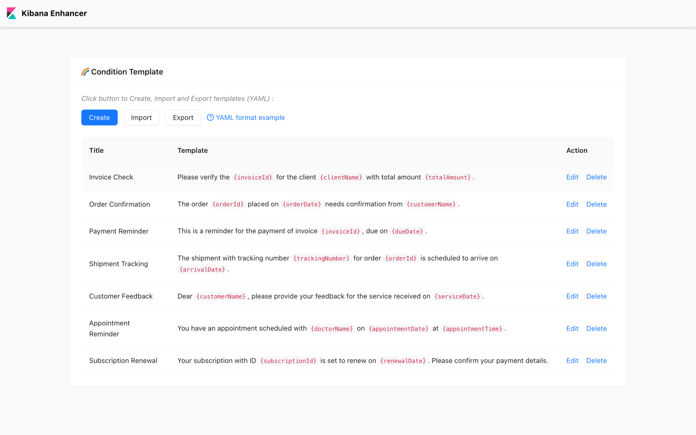
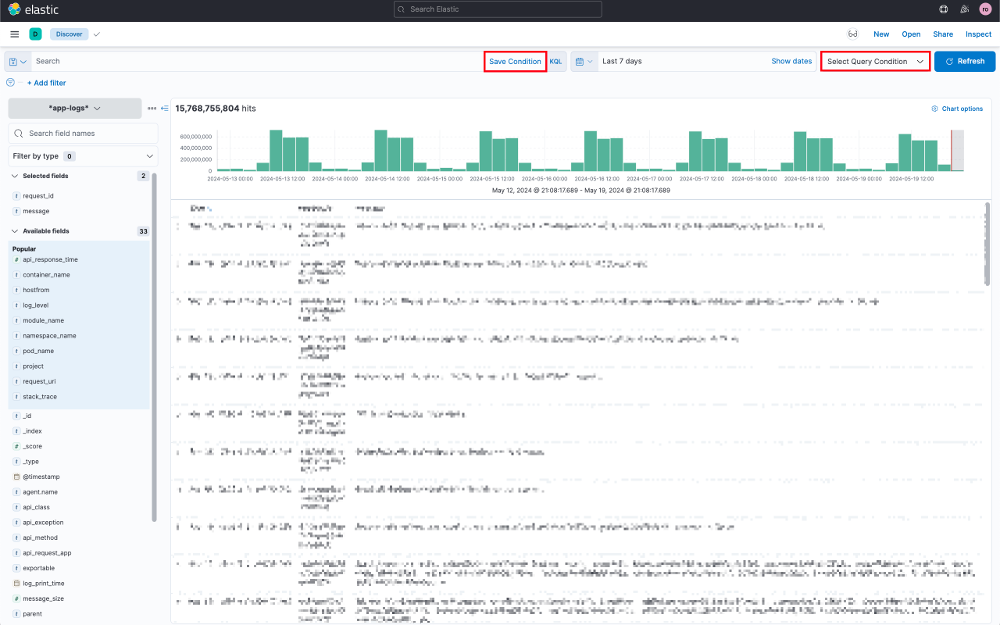

# Kibana Enhancer (MV3)

## 🎯 Features

This browser extension is a front-end application designed for managing and selecting query conditions. It provides features such as dynamically loading query conditions, saving user-defined query conditions, and formatting table content to enhance user efficiency in data management and querying.





## 🌵 Tech Stack

- **React**: Used for building user interfaces.
- **Ant Design (antd)**: An enterprise-level UI design language and React component library.
- **DOMPurify**: Used for safely sanitizing HTML content to prevent XSS attacks.
- **MutationObserver**: Used to listen to DOM changes and execute corresponding callbacks.
- **JavaScript**: The primary page inject programming language.

## 🌎 Getting Started

1. Check if your [Node.js](https://nodejs.org/) version is >= **18**.

2. Clone this repository.

3. Run `npm install` to install the dependencies.

4. Run `npm start`

5. Load your extension on Chrome following:

   a. Access `chrome://extensions/`

   b. Check `Developer mode`

   c. Click on `Load unpacked extension`

   d. Select the `build` folder.

6. Happy hacking.

## 😎 Webpack auto-reload and HRM

To make your workflow much more efficient this boilerplate uses the [webpack server](https://webpack.github.io/docs/webpack-dev-server.html) to development (started with `npm start`) with auto reload feature that reloads the browser automatically every time that you save some file in your editor.

You can run the dev mode on other port if you want. Just specify the env var `port` like this:

```
$ PORT=6002 npm run start
```

>**Tips**: Content Scripts is not supported to HRM in manifest version 3.

## 📦 Packing

After the development of this extension run the command

```
$ NODE_ENV=production npm run build
```

Now, the content of `build` folder will be the extension ready to be installed and published to the Chrome Web Store.

## 🔗 Resources

- [Webpack documentation](https://webpack.js.org/concepts/)
- [Chrome Extension documentation](https://developer.chrome.com/extensions/getstarted)

## 🪪 License

This project is open-sourced under the MIT license. For more details, see the [LICENSE](https://github.com/your/repo/blob/master/LICENSE) file.
